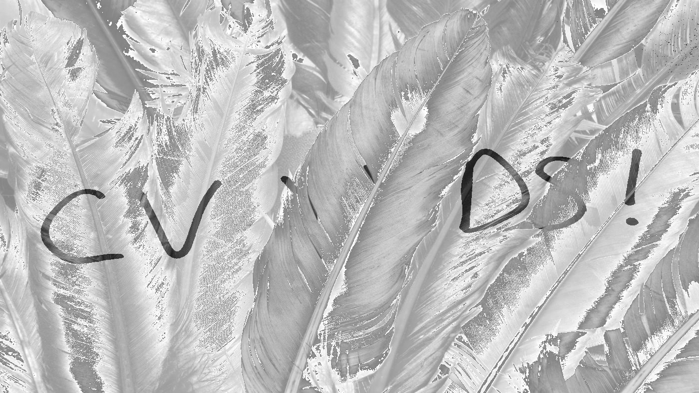
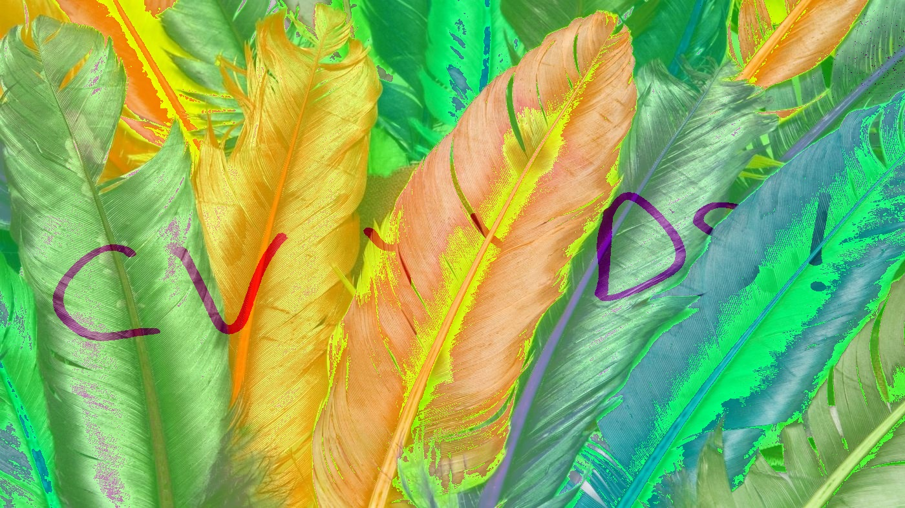

## Q1

将附带的彩色图像（I0）转为灰度图像（记为I1）。

## Q2

在白纸上手写“CV YYDS”几个字，手机拍照，转为与I1分辨率相同的二值图像（记为I2）。

## Q3

灰度图像每个像素的灰度值为1个字节（8位），按照从低到高记为L1、L2、…、L8。将I1中每个像素的L1、L2、…、L8分别用I2替换。对结果进行分析。

### 结果

### 分析

在二值图像中，像素值只有两种可能：0（代表黑色）和255（代表白色）。在二进制表示中，255是11111111，也就是说，从L1到L8，所有的位都是1。

所以，从替换L1到替换L8，也就是0000 0001到1000 0000逐渐嵌入（或运算）到灰度图像中，图像“亮”的程度越来越大，而“CV YYDS!”的部分是保留的，因此图像逐渐出现“CV YYDS!”的字样，而且这个字样的强度在逐渐增强，直到替换L8时达到最强。

基本上4和5的时候初露端倪

## Q4

### 结果

R, G, B分别的L8替换结果

### 分析

看起来是G通道中嵌入的字样比较明显

## Q5

对附带彩色图像（I0）进行亮度变换、对比度变换、饱和度变换（变换程度自行确定）。对结果进行分析。

### 原始图像

### 亮度增加

### 对比度增加

### 饱和度增加

### 分析

#### **亮度增加**

增加亮度意味着使图像看起来更亮。所有颜色都将向更亮的方向移动，使整个图像变得更明亮。但是过度增加亮度可能会导致图像的亮部细节丢失，因为亮度过高的区域可能会全部变成纯白色。

**实现**：通过在`cv2.convertScaleAbs`函数中设置`alpha=1`（保持对比度不变）和`beta=100`（将100加到图像的每个颜色通道），实现了亮度增加。`convertScaleAbs`确保了最终的像素值被适当地限制在0到255内。

#### **对比度增加**

增加对比度会使图像的暗部更暗，亮部更亮，从而加深图像的整体差异，让图像看起来更有深度和细节。增加对比度通常可以让图像看起来更鲜明，更加吸引人。但是如果对比度增加过多，可能会导致暗部和亮部的细节丢失。

**实现**：通过在`cv2.convertScaleAbs`函数中设置`alpha=2`（加倍原始图像的对比度）和`beta=0`（保持亮度不变），实现了对比度的增加。

#### 饱和度增加

增加饱和度会使图像的颜色看起来更鲜艳、更丰富。色彩将更加深和纯，但是如果饱和度提升过高，颜色可能会看起来不自然，甚至失真。

**实现**：首先，使用`cv2.cvtColor`将图像从BGR颜色空间转换到HSV空间。在HSV空间中，饱和度是由S通道表示的。通过`cv2.add`函数，将S通道的每个像素值增加50（同时利用`cv2.add`自动处理溢出的情况，确保值在0-255之间）。最后，将调整后的HSV图像重新合并，并转换回BGR颜色空间。

# 错误修正
在Q3中，像素替换实际上做了异或，所以图像有些问题，正确做法见leo文件夹
