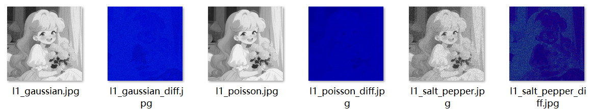
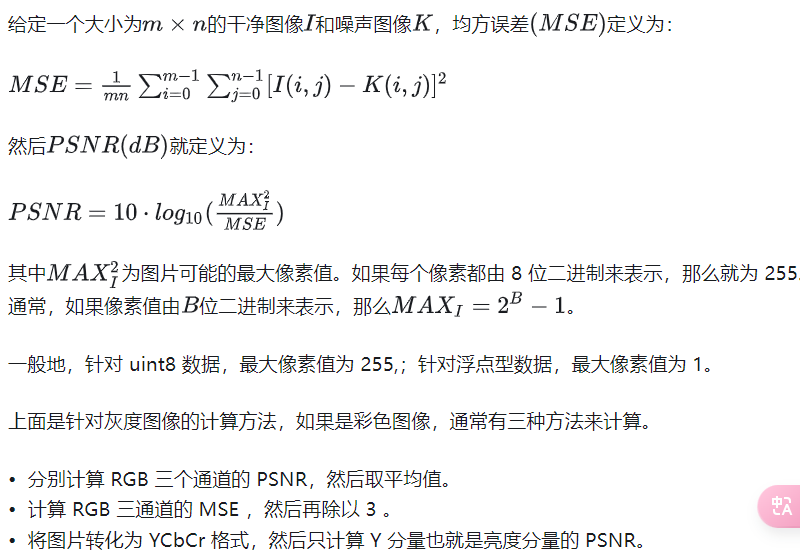
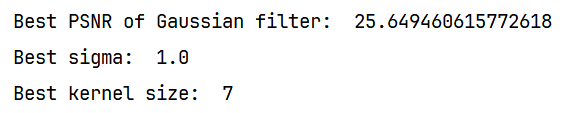
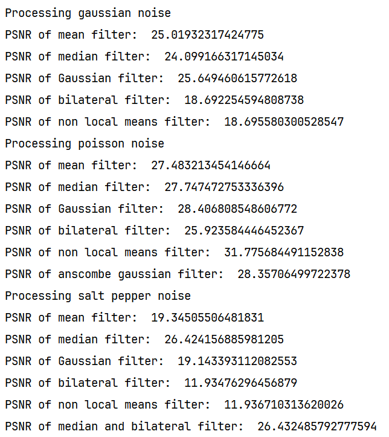

# Q2

## 高斯噪声

高斯噪声产生一种随机的灰度级变化，使得图像看起来更"粗糙"。这种噪声不是集中在特定区域，而是均匀分布于整个图像上，导致整体图像的对比度下降，细节模糊。高斯噪声通常看起来像是图像上覆盖了一层细小的灰尘或雾霾。

## 椒盐噪声

椒盐噪声的效果是在图像上随机分布的白点255（白色，即“盐”）和黑点0（黑色，即“椒”），这使得图像看起来像是受到了随机噪声的干扰。这种效果在视觉上通常很明显，并且可以通过调整`salt_prob`和`pepper_prob`来控制噪声的密度。

设置合适的 `salt_prob`（盐噪声概率）和 `pepper_prob`（椒噪声概率）取决于希望噪声的密度以及噪声的可视效果。在大多数实际应用中，椒盐噪声的比例通常相对较低，因为高比例的椒盐噪声会显著降低图像质量，并且对图像的视觉和分析应用有负面影响。以下是一些常见的设置建议：

1. **低密度噪声**：如果目的是模拟轻微的传感器误差或传输误差，可以将椒盐噪声的概率设置得很低。例如：
   - `salt_prob = 0.01`（1%的像素被设置为白色）
   - `pepper_prob = 0.01`（1%的像素被设置为黑色）
2. **中等密度噪声**：对于需要更明显的噪声效果，以测试图像处理算法的鲁棒性（例如，噪声滤波器的性能测试），可以使用中等概率：
   - `salt_prob = 0.05`（5%的像素被设置为白色）
   - `pepper_prob = 0.05`（5%的像素被设置为黑色）
3. **高密度噪声**：在某些极端情况下，可能需要测试图像处理算法在高噪声环境下的效能，此时可以使用更高的噪声概率：
   - `salt_prob = 0.1`（10%的像素被设置为白色）
   - `pepper_prob = 0.1`（10%的像素被设置为黑色）

## 泊松噪声

泊松噪声根据泊松分布添加噪声，这种噪声通常与图像本身的亮度有关，因此泊松噪声也被称为“信号依赖噪声”。

**效果说明：**

- 泊松噪声的强度依赖于图像像素值的大小。亮区域的噪声更为明显。
- 这种噪声使图像的亮部看起来有随机的亮斑，适合模拟光子噪声等物理过程。

> btw，物理上好像确实有个什么泊松亮斑来着

## 分析

把diff使用伪彩色空间展示出来

# Q3

## PSNR

使用PSNR作为去噪评估指标

> https://zhuanlan.zhihu.com/p/50757421

## SSIM

> 这个没算

PSNR（峰值信噪比）：用得最多，但是其值不能很好地反映人眼主观感受。一般取值范围：20-40.值越大，视频质量越好。

SSIM（结构相似性）：计算稍复杂，其值可以较好地反映人眼主观感受。一般取值范围：0-1.值越大，视频质量越好。

## 做了下网格搜索

尝试寻找高斯滤波对于高斯噪声图像的参数寻优

发现好像变化不大

 

## 结果

PSNR值

 

### 滤波器说明

以下分别按照

基本的五种如下

均值滤波处理 | 中位数滤波处理 | 高斯滤波处理

双边滤波 | 非局部均值滤波

（以及还会有某些特有的尝试的方法）

### 高斯噪声

5种

|  |  |
| ------------------------------------------------------------ | ------------------------------------------------------------ |
|  |  |
|  |                                                              |
|                                                              |                                                              |

对于高斯噪声，**高斯滤波器、均值滤波器和中值滤波器的效果最好（差不太多）**。这是因为这两种滤波器都是线性滤波器，能够很好地处理高斯噪声。双边滤波器和非局部均值滤波器的效果较差，可能是因为它们在保护图像细节的同时，也保留了一部分噪声。

### 泊松噪声

5+1

|  |  |
| ------------------------------------------------------------ | ------------------------------------------------------------ |
|  |      |
|  |                                                              |
| 下图为波士顿变换滤波结果                                     |                                                              |
|  |                                                              |

对于泊松噪声，**非局部均值滤波器的效果最好**，紧随其后的是**高斯滤波器**和**波士顿变换后的高斯滤波器**。非局部均值滤波器是一种基于图像的自相似性的滤波器，它能够在保护图像细节的同时，有效地去除噪声。波士顿变换能够将泊松噪声转换为高斯噪声，然后就可以使用对高斯噪声处理效果较好的滤波器来进行去噪。

### 椒盐噪声

5+1

|  |  |
| ------------------------------------------------------------ | ------------------------------------------------------------ |
|  |  |
|  |                                                              |
| 下图为中值+双边                                              |                                                              |
|  |                                                              |

对于盐和椒噪声，**中值+双边的效果最好，但其实也跟中值差不了多少，效果相较于其他很明显（虽然还留下了相当一部分“椒”点）**，这是因为中值滤波器能够很好地去除这种类型的尖峰噪声。双边滤波器和非局部均值滤波器的效果较差，可能是因为它们在保护图像细节的同时，也保留了一部分噪声。

# Q4

