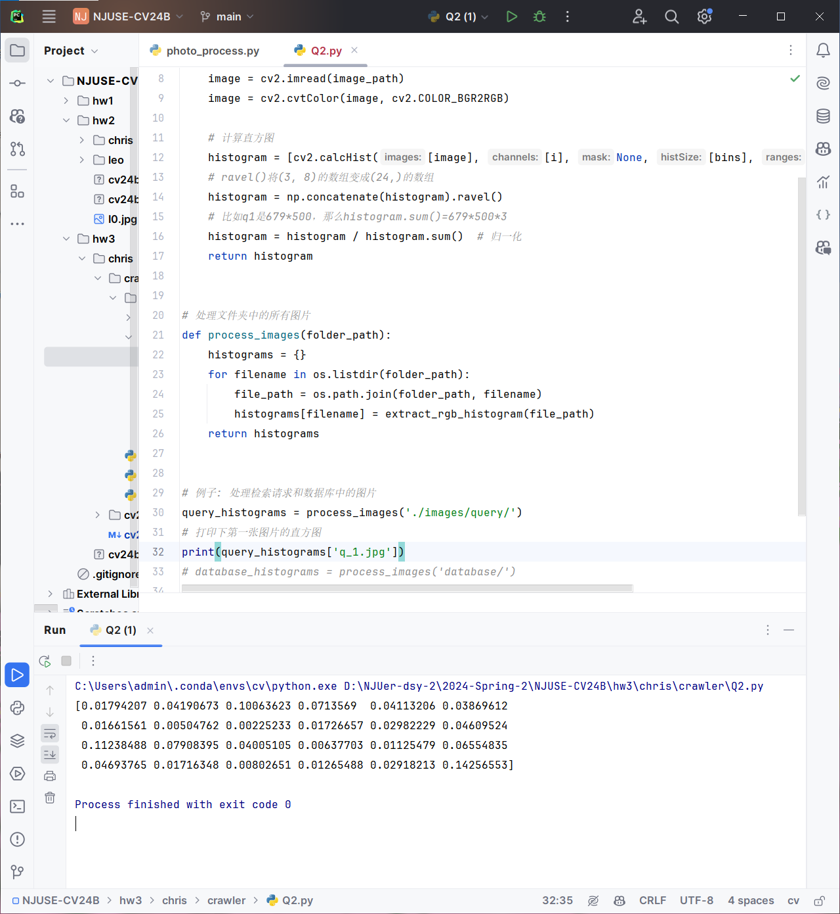

## Q2

打印出来的直方"图"长这样

## Q3

### SIFT介绍

### 通俗介绍

SIFT（尺度不变特征变换）是一种用于图像识别和匹配的技术。想象你有两张照片，它们可能在不同的时间或角度拍摄，但你想确认它们拍的是否是同一个场景。SIFT能帮助你做到这一点。它会在每张图片中找到一些“特别”的点（就像我们在人脸上认出眼睛、鼻子等特征点），然后描述这些点的周围环境。即使照片被放大、缩小或旋转，这些特征点和描述都不会改变太多。这样，你就可以用这些特征点来比较两张照片，看看它们是否相似。

### 专业介绍

SIFT（Scale-Invariant Feature Transform）是一种用于提取图像局部特征的算法，由David Lowe于1999年提出。SIFT特征对图像的尺度、旋转和部分仿射变换具有不变性，并对光照变化具有鲁棒性。SIFT主要分为以下几个步骤：

1. **尺度空间极值检测 (Scale-Space Extrema Detection)**：
   - 构建尺度空间，通过对图像进行高斯模糊和差分高斯（DoG）处理，检测图像在不同尺度下的局部极值点，这些极值点可能是关键点。

2. **关键点定位 (Keypoint Localization)**：
   - 对检测到的极值点进行精确定位，并去除低对比度点和边缘响应点，确保关键点的稳定性和鲁棒性。

3. **方向分配 (Orientation Assignment)**：
   - 根据关键点邻域内的梯度方向分布，为每个关键点分配一个或多个主要方向，使得描述符对旋转具有不变性。

4. **关键点描述 (Keypoint Descriptor)**：
   - 在关键点的方向和尺度下，计算其周围区域的梯度方向直方图，生成一个128维的特征向量。这个特征向量描述了关键点周围的局部图像结构。

SIFT算法的核心优势在于其对尺度、旋转以及光照变化的鲁棒性，使得它在图像匹配、物体识别和3D重建等任务中表现优异。通过提取和匹配图像中的SIFT特征，可以实现对不同视角和尺度下同一场景或物体的识别和比较。