# 《计算机视觉》（本科，2024）作业3

<table style="border-collapse: separate; border-spacing: 5px; border: none;">
  <tr>
    <td style="border: none; font-size: 15px;" align="center">丁晟元</td>
    <td style="border: none; font-size: 15px;" align="center">杜凌霄</td>
  </tr>
  <tr>
    <td style="border: none; font-size: 15px;" align="center">211250097</td>
    <td style="border: none; font-size: 15px;" align="center">211250066</td>
  </tr>
</table>
## Q1

<div style="border: 2px solid #000; padding: 6px; border-radius: 5px; background-color: #f9f9f9; margin-bottom: 10px;">
  <span style="font-weight: bold; font-size: 12px;">要求说明</span>
  <p style="margin: 4px 0;">在搜索引擎上按照某一关键词，搜索50张不同的图像，从中选出5张作为检索请求，另45张作为被检索图像。</p>
</div>

使用爬虫，在**百度图片**进行搜索，关键词为**“南京大学鼓楼校区北大楼”**，先爬取了90张图片（以防有不相关的，因此先多爬取了点，例如结果中有爬到了紫峰大厦），经过筛选后留下的5+45如下所示：

这5张图像虽然都是北大楼，但是差异较为明显，也算是选了比较清晰的不同时间和视角的北大楼

### 5张检索请求图像

|  |  |  |  |  |
| ------------------------------ | ------------------------------ | ------------------------------ | ------------------------------ | ------------------------------ |

### 45张被检索图像

|  |  |  |  |  |
| -------------------------------- | -------------------------------- | -------------------------------- | -------------------------------- | -------------------------------- |
|  |  |  |  |  |
|  |  |  |  |  |
|  |  |  |  |  |
|  |  |  |  |  |
|  |  |  |  |  |
|  |  |  |  |  |
|  |  |  |  |  |
|  |  |  |  |  |

## Q2

<div style="border: 2px solid #000; padding: 6px; border-radius: 5px; background-color: #f9f9f9; margin-bottom: 10px;">
  <span style="font-weight: bold; font-size: 12px;">要求说明</span>
  <p style="margin: 4px 0;">以全局RGB颜色直方图（每通道bin的数量为8）作为特征，进行图像检索。展示每个检索请求及对应前3个结果。</p>
</div>
### 特征抽取代码（全局RGB颜色直方图）

```python
def extract_rgb_histogram(image_path, bins=8):
    # 读取图像
    image = cv2.imread(image_path)
    if image is None:
        raise ValueError(f"无法读取图像文件: {image_path}")
    image = cv2.cvtColor(image, cv2.COLOR_BGR2RGB)

    # 计算直方图
    histogram = [cv2.calcHist([image], [i], None, [bins], [0, 256]) for i in range(3)]
    # ravel()将(3, 8)的数组变成(24,)的数组
    histogram = np.concatenate(histogram).ravel()
    # 比如q1是679*500，那么histogram.sum()=679*500*3
    histogram = histogram / histogram.sum()  # 归一化
    return histogram


# 处理文件夹中的所有图片
def process_images(folder_path):
    histograms = {}
    for filename in os.listdir(folder_path):
        file_path = os.path.join(folder_path, filename)
        if os.path.isfile(file_path) and file_path.lower().endswith(('.png', '.jpg', '.jpeg', '.bmp', '.tiff')):
            try:
                histograms[filename] = extract_rgb_histogram(file_path)
            except ValueError as e:
                print(e)
    return histograms


# 完成图片RGB直方图(24个bin总共)的提取
query_histograms = process_images('./images/query/')
database_histograms = process_images('./images/database/')
```

### 检索（特征匹配）代码

```python
# 检索
# 计算相似度
# 每个query存储相似度最高的三个
results = {}
for query_name, query_histogram in query_histograms.items():
    similarities = []
    for database_name, database_histogram in database_histograms.items():
        # 相似度计算使用欧式距离
        similarity = np.linalg.norm(query_histogram - database_histogram)
        similarities.append((database_name, similarity))
    # 按相似度排序并取前三个
    similarities.sort(key=lambda x: x[1])
    results[query_name] = similarities[:3]
    # 后三个保存下相似度最小的三个，主要是对比下数值
    similarities.sort(key=lambda x: x[1], reverse=True)
    results[query_name] += similarities[:3]

# 打印结果
for query_name, top_matches in results.items():
    print(f"Query Image: {query_name}")
    # 前三个是相似度最高（也就是欧式距离最小）的
    print("Top 3 Matches:")
    for i, (match_name, similarity) in enumerate(top_matches[:3], start=1):
        print(f"  {i}. {match_name} - Similarity: {similarity:.2f}")
    # 后三个是相似度最低（也就是欧式距离最大）的
    print("Bottom 3 Matches:")
    for i, (match_name, similarity) in enumerate(top_matches[3:], start=1):
        print(f"  {i}. {match_name} - Similarity: {similarity:.2f}")
```

### 结果

程序运行结果如下

| 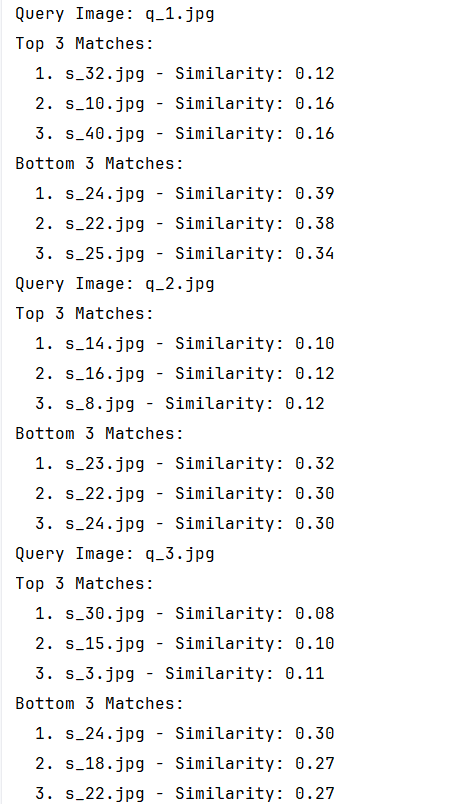 | 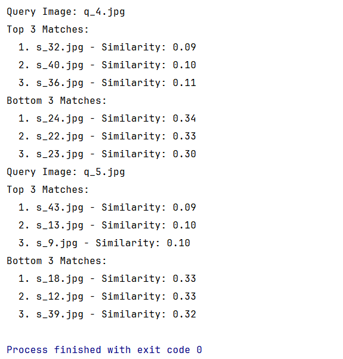 |
| ------------------------------------------------------------ | ------------------------------------------------------------ |

|              query               |                        top1                         |                        top2                         |                        top3                         |
| :------------------------------: | :-------------------------------------------------: | :-------------------------------------------------: | :-------------------------------------------------: |
|                q1                |                         32                          |                         10                          |                         40                          |
| 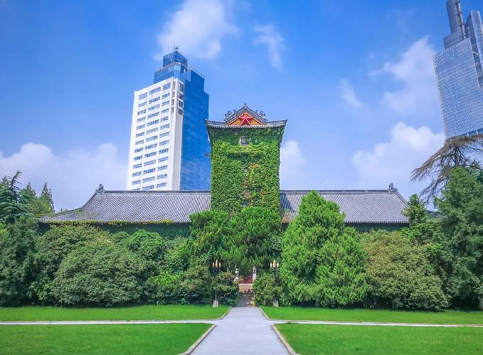 | 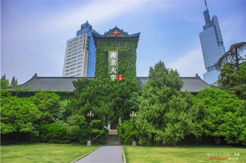  | 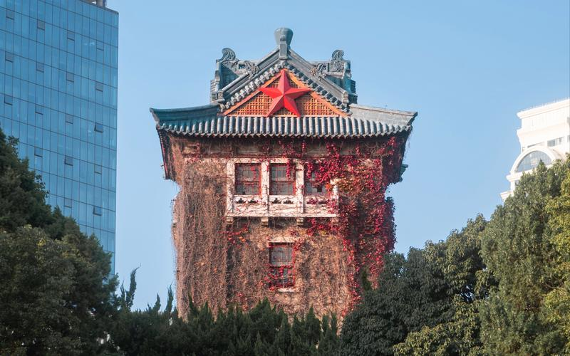  | 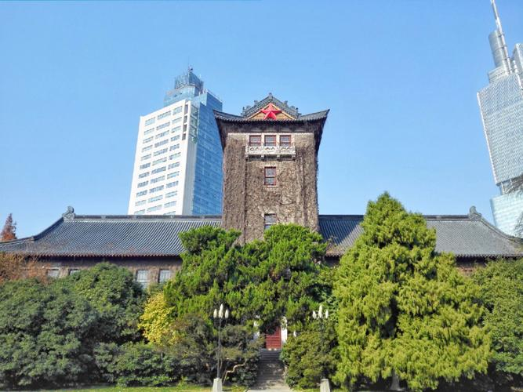 |
|                q2                |                         14                          |                         16                          |                          8                          |
| 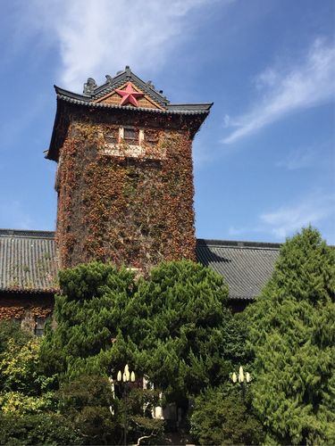 | 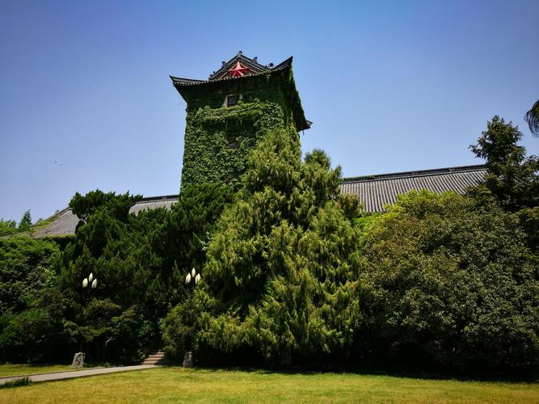 |  |  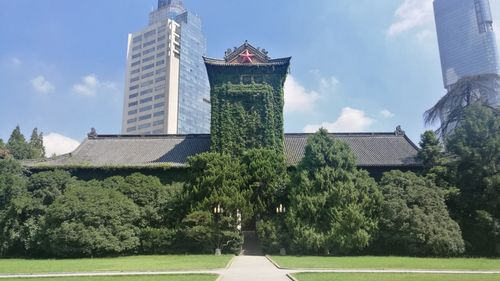  |
|                q3                |                         30                          |                         15                          |                          3                          |
|  | 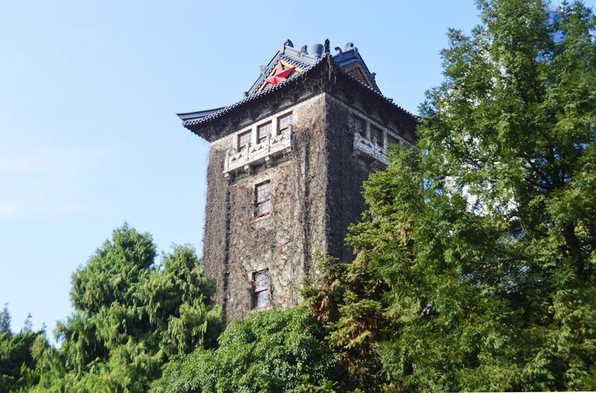 | 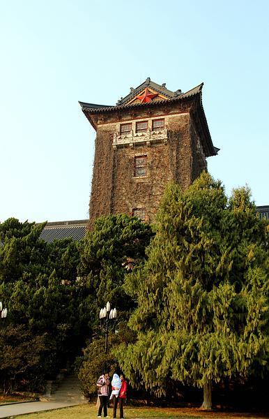 |  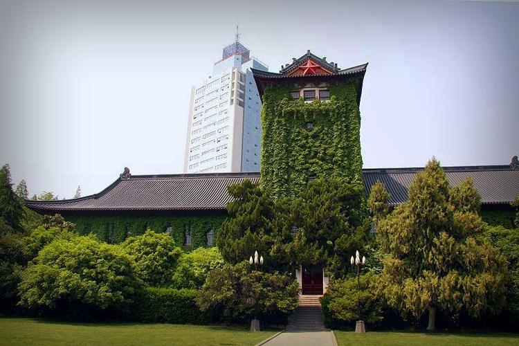  |
|                q4                |                         32                          |                         40                          |                         36                          |
| 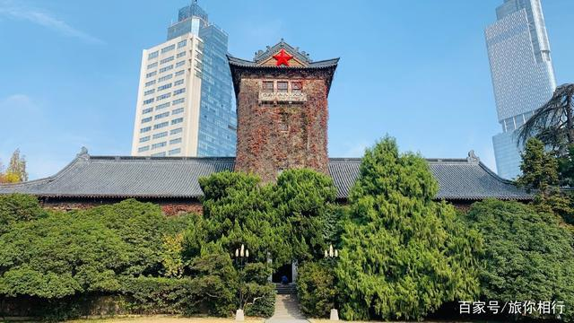 |  |  | 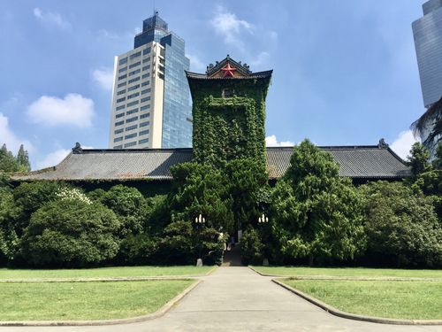 |
|                q5                |                         43                          |                         13                          |                          9                          |
| 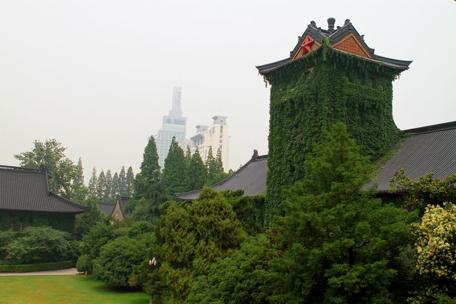 |  |  |    |


## Q3

<div style="border: 2px solid #000; padding: 6px; border-radius: 5px; background-color: #f9f9f9; margin-bottom: 10px;">
  <span style="font-weight: bold; font-size: 12px;">要求说明</span>
  <p style="margin: 4px 0;">选择SIFT特征，重复问题2。</p>
</div>
### SIFT特征抽取代码的来源及说明

### SIFT特征匹配代码的来源及说明

（检索请求+前3个结果）

### 结果

程序执行结果如下

| 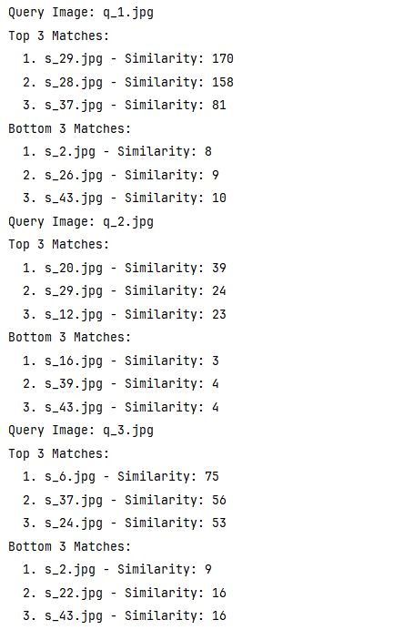 | 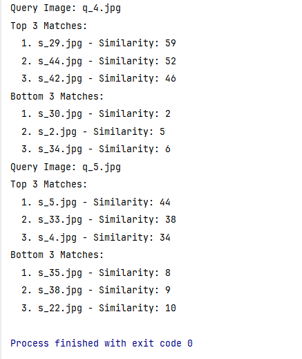 |
| ------------------------------------------------------------ | ------------------------------------------------------------ |

> 注，topk列如 29(170)代表s_29.jpg，与相对应query相似度计算是170

|                       query                       |                        top1                         |                        top2                         |                        top3                         |
| :-----------------------------------------------: | :-------------------------------------------------: | :-------------------------------------------------: | :-------------------------------------------------: |
|                        q1                         |                       29(170)                       |                       28(158)                       |                       37(81)                        |
|  |  | 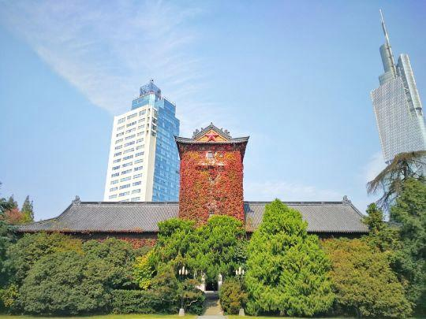 |  |
|                        q2                         |                       20(39)                        |                       29(24)                        |                       12(23)                        |
|  | 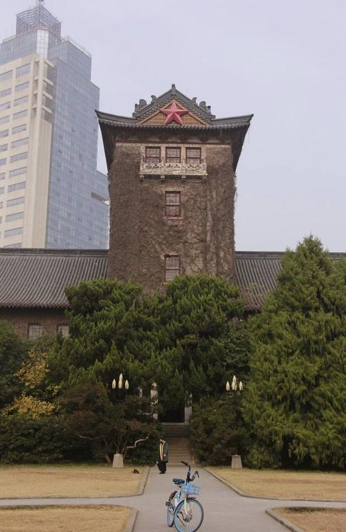 |  |  |
|                        q3                         |                        6(75)                        |                       37(56)                        |                       24(53)                        |
| 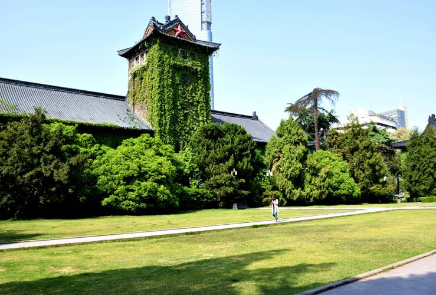 |  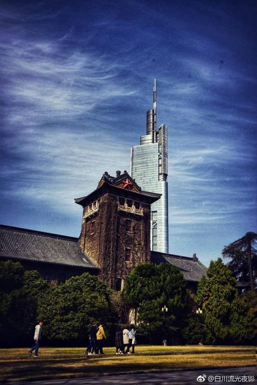  | 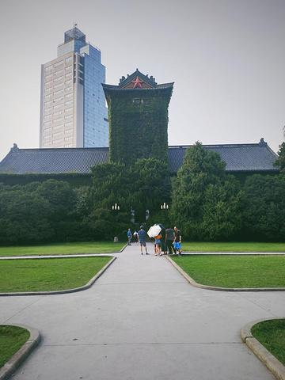 | 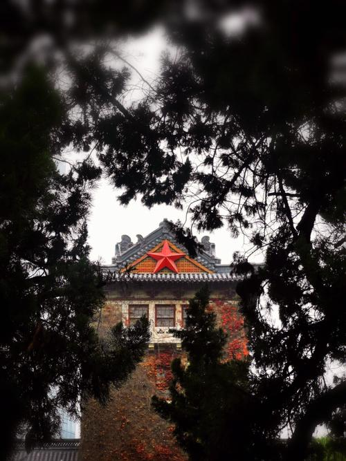 |
|                        q4                         |                       29(59)                        |                       44(52)                        |                       42(46)                        |
|  |  | 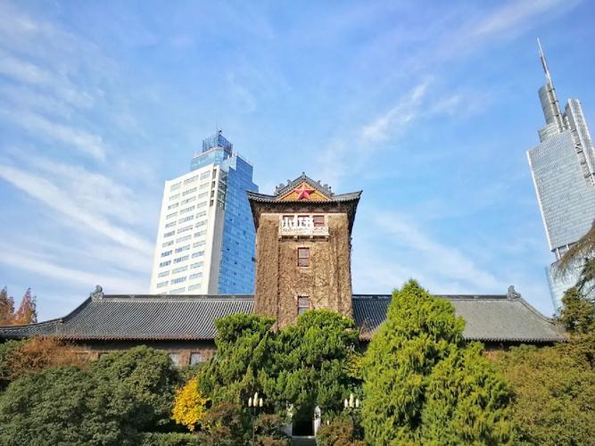 | 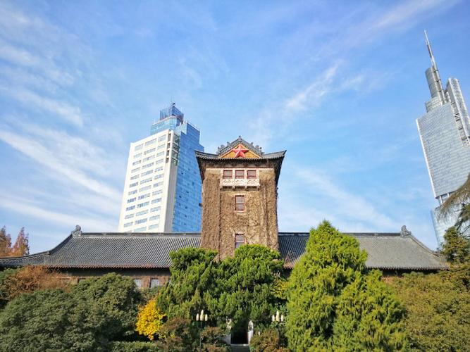 |
|                        q5                         |                        5(44)                        |                       33(38)                        |                        4(34)                        |
|  |  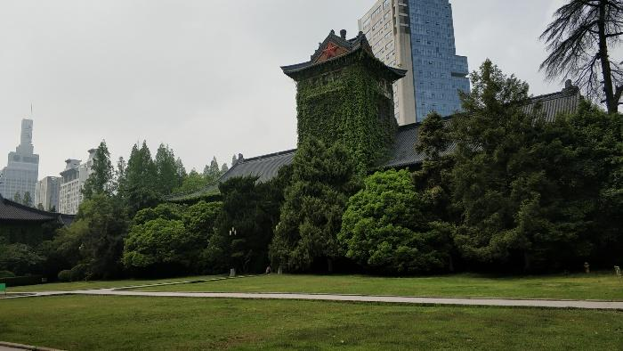  | 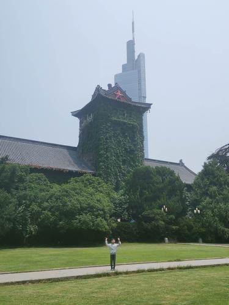 |  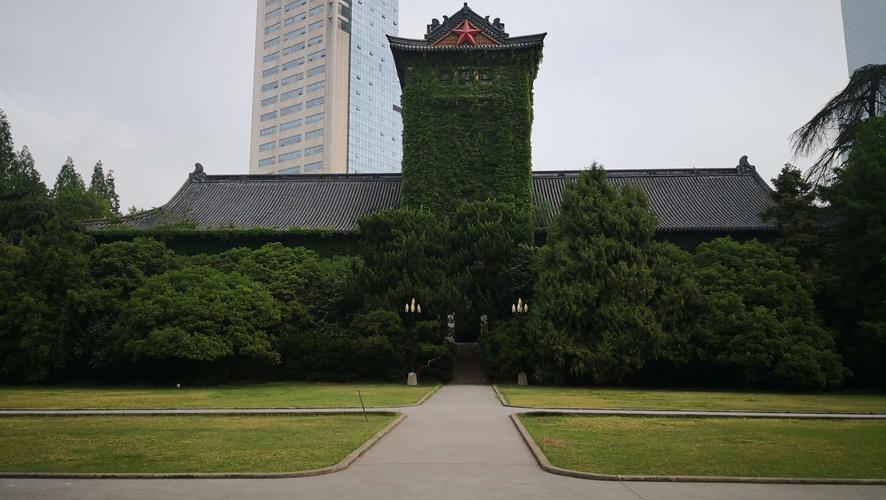  |


## Q4

<div style="border: 2px solid #000; padding: 6px; border-radius: 5px; background-color: #f9f9f9; margin-bottom: 10px;">
  <span style="font-weight: bold; font-size: 12px;">要求说明</span>
  <p style="margin: 4px 0;">将问题2和问题3的结果进行比较和分析。</p>
</div>
## 比较和分析

感觉RGB颜色直方图在我的这个实验环境下很容易受比如“天空”“草地”颜色的干扰，导致我认为是主体的“北大楼”并不一定被很好匹配

