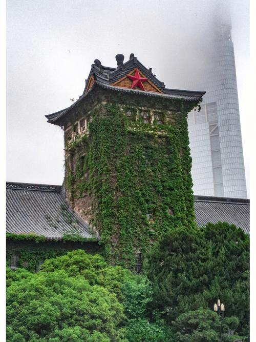

# 《计算机视觉》（本科，2024）作业3

<table style="border-collapse: separate; border-spacing: 5px; border: none;">
  <tr>
    <td style="border: none; font-size: 15px;" align="center">丁晟元</td>
    <td style="border: none; font-size: 15px;" align="center">杜凌霄</td>
  </tr>
  <tr>
    <td style="border: none; font-size: 15px;" align="center">211250097</td>
    <td style="border: none; font-size: 15px;" align="center">211250066</td>
  </tr>
</table>
## Q1

  要求说明
  
在搜索引擎上按照某一关键词，搜索50张不同的图像，从中选出5张作为检索请求，另45张作为被检索图像。

使用爬虫，在**百度图片**进行搜索，关键词为**“南京大学鼓楼校区北大楼”**，先爬取了90张图片（以防有不相关的，因此先多爬取了点，例如结果中有爬到了紫峰大厦），经过筛选后留下的5+45如下所示：

这5张图像虽然都是北大楼，但是差异较为明显，也算是选了比较清晰的不同时间和视角的北大楼

### 5张检索请求图像

|  |  |  |  |  |
| ------------------------------ | ------------------------------ | ------------------------------ | ------------------------------ | ------------------------------ |

## 45张被检索图像

|  |  |  |  |  |
| -------------------------------- | -------------------------------- | -------------------------------- | -------------------------------- | -------------------------------- |
|  |  |  |  |  |
|  |  |  |  |  |
|  |  |  |  |  |
|  |  |  |  |  |
|  |  |  |  |  |
|  |  |  |  |  |
|  |  |  |  |  |
|  |  |  |  |  |

## Q2

  要求说明
  
以全局RGB颜色直方图（每通道bin的数量为8）作为特征，进行图像检索。展示每个检索请求及对应前3个结果。

【特征抽取代码贴这里】

【检索（特征匹配）代码贴这里】

【结果（检索请求+前3个结果）贴这里】

## Q3

  要求说明
  
选择SIFT特征，重复问题2。

【SIFT特征抽取代码的来源及说明贴这里】

【SIFT特征匹配代码的来源及说明贴这里】

【结果（检索请求+前3个结果）贴这里】

## Q4

  要求说明
  
将问题2和问题3的结果进行比较和分析。

【比较和分析结果贴这里】

