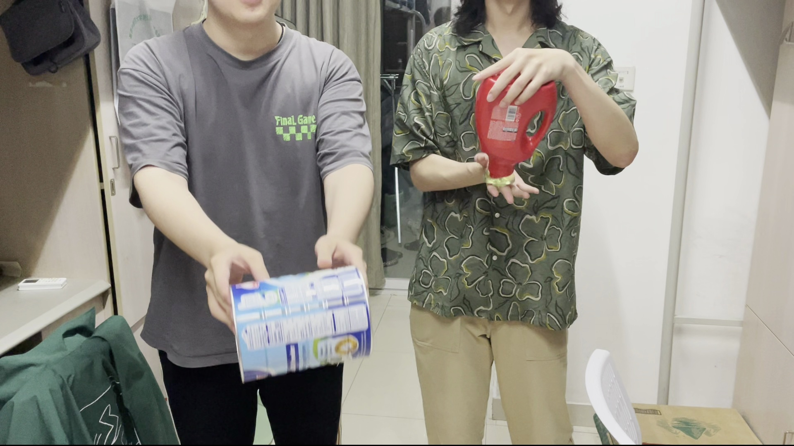
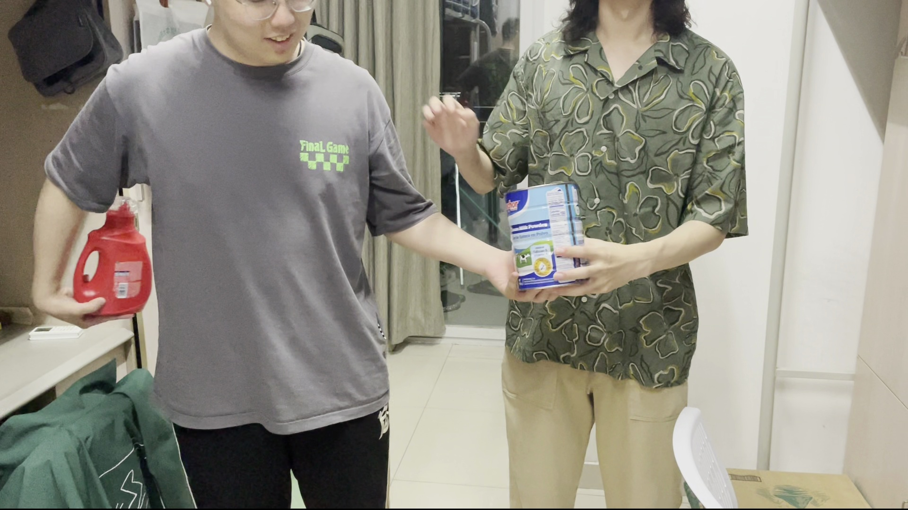

# 《计算机视觉》（本科，2024）作业4

<table style="border-collapse: separate; border-spacing: 5px; border: none;">
  <tr>
    <td style="border: none; font-size: 15px;" align="center">丁晟元</td>
    <td style="border: none; font-size: 15px;" align="center">杜凌霄</td>
  </tr>
  <tr>
    <td style="border: none; font-size: 15px;" align="center">211250097</td>
    <td style="border: none; font-size: 15px;" align="center">211250066</td>
  </tr>
</table>
## Q1

<div style="border: 2px solid #000; padding: 6px; border-radius: 5px; background-color: #f9f9f9; margin-bottom: 10px;">
  <span style="font-weight: bold; font-size: 12px;">要求说明</span>
  <p style="margin: 4px 0;">拍一段包含全组成员的视频，要求：</p>
<p style="margin: 4px 0;">1）视频时长30秒左右；</p>
<p style="margin: 4px 0;">2）每位成员手持一个不同的物体（饮料瓶、公仔等），起始时包含所有物体；</p>
<p style="margin: 4px 0;">3）画面中所有的物体要有各自的运动，不能保持静止不动，每个物体要有一段时间被遮挡或者移出画面。</p>
</div>


视频总长度31s，包含物体：洗衣液、奶粉罐

其中两个物体在两人手中交换，并且在某些时间点出现部分遮挡，两个物体不是所有时间都在画面内。


|  |  |
| ------------------- | ------------------- |
|  |  |
|  |  |
|  |  |
|  |  |


## Q2

<div style="border: 2px solid #000; padding: 6px; border-radius: 5px; background-color: #f9f9f9; margin-bottom: 10px;">
  <span style="font-weight: bold; font-size: 12px;">要求说明</span>
  <p style="margin: 4px 0;">找一个已有的、非深度学习的目标检测算法，对视频中的每个物体进行检测（如果需要，可以进行训练），并对检测结果进行分析。</p>
</div>
### 代码介绍（来源：与gpt合作）

```python
import os

import cv2
import numpy as np

frames_dir = 'frames'

if not os.path.exists("detections"):
    os.makedirs("detections")

# 加载模型和创建边缘检测对象
model = 'model.yml.gz'
edge_detector = cv2.ximgproc.createStructuredEdgeDetection(model)

# 打开视频文件
video_path = '../video.mp4'
cap = cv2.VideoCapture(video_path)

# 检查视频是否成功打开
if not cap.isOpened():
    print("Error: Could not open video.")
    exit()

frame_count = int(cap.get(cv2.CAP_PROP_FRAME_COUNT))
fps = int(cap.get(cv2.CAP_PROP_FPS))
print(f"Total frames: {frame_count}, FPS: {fps}")

frame_interval = fps  # 每秒抽取一帧

current_frame = 0
extracted_frames = 0

if not os.path.exists("frames"):
    os.makedirs("frames")

while True:
    ret, frame = cap.read()
    if not ret:
        break

    # 抽取帧
    if current_frame % frame_interval == 0:
        # 将图像转换为 32 位浮点型
        rgb_image = frame.astype(np.float32) / 255.0

        # 检测边缘
        edges = edge_detector.detectEdges(rgb_image)

        # 计算方向图
        orientation_map = edge_detector.computeOrientation(edges)

        # 抑制非最大值
        edges = edge_detector.edgesNms(edges, orientation_map)

        # 创建 Edge Boxes 对象
        edge_boxes = cv2.ximgproc.createEdgeBoxes()
        edge_boxes.setMaxBoxes(5)  # 设置最大候选区域数量

        # 计算候选区域
        boxes = edge_boxes.getBoundingBoxes(edges, orientation_map)[0]

        # 绘制候选区域
        for box in boxes:
            x, y, w, h = box
            cv2.rectangle(frame, (x, y), (x + w, y + h), (0, 255, 0), 2)

        # 显示结果
        frame_filename = f"./detections/frame_{extracted_frames}_detect.jpg"
        cv2.imwrite(frame_filename, frame)
        print(f"Detect frame {extracted_frames}")
        extracted_frames += 1

    current_frame += 1

cap.release()
print("Object detection completed.")
```

**使用 Edge Boxes 算法**

- 每秒抽取一帧。

- 将图像转换为32位浮点型并归一化。

- 进行边缘检测、方向图计算和非最大值抑制。

- 创建`Edge Boxes`对象并设定最大候选区域数量。

- 计算候选区域并绘制在帧上。

首先，每秒抽取一帧。然后，将抽取的帧转换为32位浮点数，并将像素值归一化到[0, 1]范围内，这是为了适应边缘检测算法的需求。接着，利用预先加载的边缘检测模型对图像进行边缘检测，生成一个边缘图，这个图像突出显示了图像中的边缘。随后，计算边缘的方向图，这一步帮助确定每个边缘的方向，为后续的非最大值抑制和边缘框检测提供信息。在非最大值抑制步骤中，保留强边缘，去除弱边缘，以减少噪声并提高边缘检测的准确性。

接下来，创建一个用于生成候选区域的边缘框对象，并设置最多生成五个候选区域。使用边缘图和方向图计算候选区域，这些区域可能包含目标物体。然后，遍历所有检测到的候选区域，在原始帧上绘制矩形框，以绿色框标记出检测到的区域。

### 检测结果


|  |  |
| ------------------- | ------------------- |
|  |  |
|  |  |
|  |  |
|  |  |

### 分析

1. **检测框的准确性**:
   - 每个框都标记了检测到的物体，检测框较好地包围了物体。
   - 某些框虽然检测到了物体，但可能包含了较多的背景区域。

## Q3

<div style="border: 2px solid #000; padding: 6px; border-radius: 5px; background-color: #f9f9f9; margin-bottom: 10px;">
  <span style="font-weight: bold; font-size: 12px;">要求说明</span>
  <p style="margin: 4px 0;">找一个已有的、非深度的目标跟踪算法（单目标跟踪算法或多目标跟踪算法均可），在第一帧对各个物体进行初始化标注，再对各个物体进行跟踪（如果采用单目标跟踪算法，则对各个物体分别跟踪），并将跟踪结果与每帧的检测结果进行对比和分析。</p>
</div>
### 代码介绍（来源：与gpt合作）


```python
import os.path

import cv2


cap = cv2.VideoCapture('../video.mp4')

frame_count = int(cap.get(cv2.CAP_PROP_FRAME_COUNT))
fps = int(cap.get(cv2.CAP_PROP_FPS))
print(f"Total frames: {frame_count}, FPS: {fps}")

frame_interval = fps  # 每秒抽取一帧

# 初始化多目标跟踪器
multi_tracker = cv2.legacy.MultiTracker_create()

# 读取第一帧
ret, frame = cap.read()
if not ret:
    print("无法读取视频文件")
    exit()

# 在第一帧上手动标注目标
bboxes = []
while True:
    bbox = cv2.selectROI('MultiTracker', frame)
    if bbox != (0, 0, 0, 0):
        bboxes.append(bbox)
        print("已选择的框:", bbox)
    k = cv2.waitKey(0) & 0xFF
    if k == 27:  # 按Esc键退出
        break

total_obj = len(bboxes)

# 添加KCF跟踪器
for bbox in bboxes:
    multi_tracker.add(cv2.legacy.TrackerKCF_create(), frame, bbox)

current_frame = 0
extracted_frames = 0

if not os.path.exists('trackings'):
    os.makedirs('trackings')


# 用于存储丢失物体的索引和丢失的起始帧数
lost_objects = {}

while cap.isOpened():
    ret, frame = cap.read()
    if not ret:
        break


    ret, boxes = multi_tracker.update(frame)
    # 绘制跟踪结果
    for i, newbox in enumerate(boxes):
        p1 = (int(newbox[0]), int(newbox[1]))
        p2 = (int(newbox[0] + newbox[2]), int(newbox[1] + newbox[3]))
        if newbox[2] > 0 and newbox[3] > 0:
            cv2.rectangle(frame, p1, p2, (0, 255, 0), 2, 1)
            cv2.putText(frame, f'Object {i + 1}', (p1[0], p1[1] - 10), cv2.FONT_HERSHEY_SIMPLEX, 0.5, (0, 255, 0), 2)

    cv2.imshow('MultiTracker', frame)

    if current_frame % frame_interval == 0:
        frame_filename = f"./trackings/frame_{extracted_frames}_track.jpg"
        cv2.imwrite(frame_filename, frame)
        print(f"Tracking frame {extracted_frames}")
        extracted_frames += 1


    current_frame += 1

    if cv2.waitKey(1) & 0xFF == 27:  # 按Esc键退出
        break

cap.release()
cv2.destroyAllWindows()

```

**使用KCF算法**

- 初始化多目标跟踪器
- 在第一帧上手动标注目标
- 为每个标注的目标添加KCF跟踪器
- 读取和处理每一帧
  - 使用多目标跟踪器更新每帧中所有目标的位置
  - 在每帧上绘制跟踪结果，标记每个目标的位置和编号

首先，创建一个多目标跟踪器对象，用于同时跟踪多个目标。在处理第一帧时，用户手动在视频帧上选择多个目标区域，并将这些选中的目标区域存储起来。然后，为每个标注的目标区域添加一个基于KCF算法的跟踪器。

在循环处理视频的每一帧时，更新多目标跟踪器，以确定每个目标在当前帧中的位置。然后，在每帧上绘制出各个目标的跟踪结果，标记目标的位置和编号，并显示带有跟踪结果的帧。

### 跟踪结果

|  |  |
| ------------------- | ------------------- |
|  |  |
|  |  |
|  |  |
|  |  |

如果从视频来看（照片中未能良好展示），在跟踪初期取得了较好的结果，但是在有物品移出过画面之后，就无法继续跟踪了，这也和目前的任务设定是纯粹的目标跟踪有关。

在物品未移出画面，依然能保持较好的跟踪结果，跟踪框的位置和尺寸较为一致，这说明检测和跟踪结果基本可靠，保持了良好的跟随性。

同时，KFC跟踪算法的效率非常高，在使用CPU单核运算的条件下，双检测框可以达到视频正常播放时的实时帧率。

## Q4

<div style="border: 2px solid #000; padding: 6px; border-radius: 5px; background-color: #f9f9f9; margin-bottom: 10px;">
  <span style="font-weight: bold; font-size: 12px;">要求说明</span>
  <p style="margin: 4px 0;">根据问题2-3，设计一个综合采用目标检测和跟踪的方法，可以根据目标检测自动发现视频中的物体，并对每个物体标识固定的ID。对问题1中的视频进行处理，并对处理结果进行分析。</p>
</div>

### 代码分析

```python
import os
import cv2
import numpy as np

# 创建文件夹
if not os.path.exists("detections"):
    os.makedirs("detections")

# 加载模型和创建边缘检测对象
model = 'model.yml.gz'
edge_detector = cv2.ximgproc.createStructuredEdgeDetection(model)

# 打开视频文件
video_path = '../video.mp4'
cap = cv2.VideoCapture(video_path)

# 检查视频是否成功打开
if not cap.isOpened():
    print("Error: Could not open video.")
    exit()

frame_count = int(cap.get(cv2.CAP_PROP_FRAME_COUNT))
frame_width = int(cap.get(cv2.CAP_PROP_FRAME_WIDTH))
frame_height = int(cap.get(cv2.CAP_PROP_FRAME_HEIGHT))
fps = int(cap.get(cv2.CAP_PROP_FPS))
print(f"Total frames: {frame_count}, FPS: {fps}")

frame_interval = fps  # 每秒抽取一帧

current_frame = 0

output_video_path = 'output.mp4'
fourcc = cv2.VideoWriter_fourcc(*'mp4v')  # 使用MP4格式
out = cv2.VideoWriter(output_video_path, fourcc, fps, (frame_width, frame_height))


# 初始化多目标跟踪器
multi_tracker = cv2.legacy.MultiTracker_create()

# 初始化目标ID
object_id = 0
object_ids = []

while cap.isOpened():
    ret, frame = cap.read()
    if not ret:
        break

    # 每隔 frame_interval 帧进行目标检测
    if current_frame % frame_interval == 0:
        # 将图像转换为 32 位浮点型
        rgb_image = frame.astype(np.float32) / 255.0

        # 检测边缘
        edges = edge_detector.detectEdges(rgb_image)

        # 计算方向图
        orientation_map = edge_detector.computeOrientation(edges)

        # 抑制非最大值
        edges = edge_detector.edgesNms(edges, orientation_map)

        # 创建 Edge Boxes 对象
        edge_boxes = cv2.ximgproc.createEdgeBoxes()
        edge_boxes.setMaxBoxes(3)  # 设置最大候选区域数量

        # 计算候选区域
        boxes = edge_boxes.getBoundingBoxes(edges, orientation_map)[0]

        # 初始化新的跟踪器和目标ID
        new_multi_tracker = cv2.legacy.MultiTracker_create()
        new_object_ids = []

        # 合并新的跟踪器和现有跟踪器
        for i in range(len(object_ids)):
            new_multi_tracker.add(cv2.legacy.TrackerKCF_create(), frame, multi_tracker.getObjects()[i])
            new_object_ids.append(object_ids[i])

        # 初始化跟踪器和目标ID
        for box in boxes:
            if len(new_object_ids) < 3:
                x, y, w, h = box
                new_multi_tracker.add(cv2.legacy.TrackerKCF_create(), frame, (x, y, w, h))
                new_object_ids.append(object_id)
                object_id += 1

        multi_tracker = new_multi_tracker
        object_ids = new_object_ids

        # 显示检测结果
        for box, obj_id in zip(boxes, new_object_ids):
            x, y, w, h = box
            cv2.rectangle(frame, (x, y), (x + w, y + h), (0, 255, 0), 2)
            cv2.putText(frame, f'ID {obj_id}', (x + 5, y + 25), cv2.FONT_HERSHEY_SIMPLEX, 0.5, (0, 255, 0), 2)


    # 更新多目标跟踪器
    ret, boxes = multi_tracker.update(frame)
    to_remove = set()
    for i, newbox in enumerate(boxes):
        p1 = (int(newbox[0]), int(newbox[1]))
        p2 = (int(newbox[0] + newbox[2]), int(newbox[1] + newbox[3]))
        if newbox[2] > 0 and newbox[3] > 0:
            cv2.rectangle(frame, p1, p2, (0, 255, 0), 2, 1)
            cv2.putText(frame, f'ID {object_ids[i]}', (p1[0] + 5, p1[1] + 25), cv2.FONT_HERSHEY_SIMPLEX, 0.5, (0, 255, 0),
                        2)
        else:
            to_remove.add(i)

    if len(to_remove) > 0:
        new_multi_tracker = cv2.legacy.MultiTracker_create()
        new_object_ids = []
        for i in range(len(object_ids)):
            if i not in to_remove:
                new_multi_tracker.add(cv2.legacy.TrackerKCF_create(), frame, multi_tracker.getObjects()[i])
                new_object_ids.append(object_ids[i])
        multi_tracker = new_multi_tracker
        object_ids = new_object_ids


    current_frame += 1
    print(current_frame)

    out.write(frame)

    cv2.imshow('MultiTracker', frame)

    if cv2.waitKey(1) & 0xFF == 27:  # 按Esc键退出
        break

cap.release()
out.release()
cv2.destroyAllWindows()
print("Object detection and tracking completed.")

```

基本上就是把第二题、第三题的代码结合起来，设定跟踪的物体总数设为3，因为在追踪过程中很可能会出现物体移出画面而跟踪结束，所以每过1s，会对画面中的物体进行检测，如果目前正在追踪的物体总数小于3，则用新检测到的物体补齐。

目标检测使用Edge Boxes，目标跟踪使用KCF

### 分析

结果由于目标检测算法的输出实际上是很多框聚集在检测到的物体旁边，所以实际上很难直接了当的检测到我们想要它检测的两个物体（洗衣液、奶粉罐），视频中目标检测检测到了人，并且跟踪了人的运动，但是由于人在过程中实际上没有怎么运动，所以检测并跟踪的结果实际上只反映了大概的运动趋势。